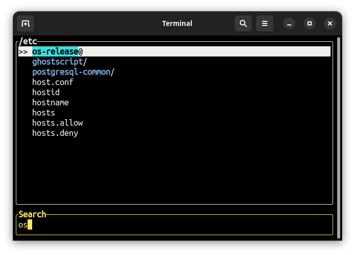

# fpick

**fpick** is an interactive file picker to traverse through directories tree in a terminal.

<div align="center">
    <a href="https://github.com/igrek51/fpick">GitHub</a>
    -
    <a href="https://crates.io/crates/fpick">Crates</a>
    -
    <a href="https://docs.rs/crate/fpick/">docs.rs</a>
</div>



## Installation
### Cargo
```sh
cargo install fpick
```
This will install `fpick` binary in Rust's Path.

### Binary
Alternatively, you can download the compiled binary:

```sh
curl -L https://github.com/igrek51/fpick/releases/download/0.3.0/fpick -o ~/bin/fpick
chmod +x ~/bin/fpick
```

## Usage
Launch the interactive file picker by running `fpick`.

Navigate with keyboard:

- `↑` and `↓` to move between files and directories,
- `→` to enter a directory.
- `←` to go up,
- Type a phrase to filter the list of files
- `Enter` to select a file, exit and print its path to stdout.

See `fpick --help` for more options.

## CLI arguments
Usage:
- `fpick [OPTIONS]` to select a file in a current directory and return its path
- `fpick [OPTIONS] <PATH>` to select a file starting from a specified directory

Options:
- `--relative`, `--rel`, `-r` - Print selected path as relative to the starting directory
- `--version` - Print version
- `--help`, `-h` - Print usage

## Examples
You can use it in combination with other commands, for example to print the selected file:
```sh
cat `fpick`
```

Tired of typing `ls` and `cd`, over and over again,
just to find a file in a deeply nested directory tree?
Use `fpick` to navigate through directories interactively:
```sh
cd `fpick`
```
